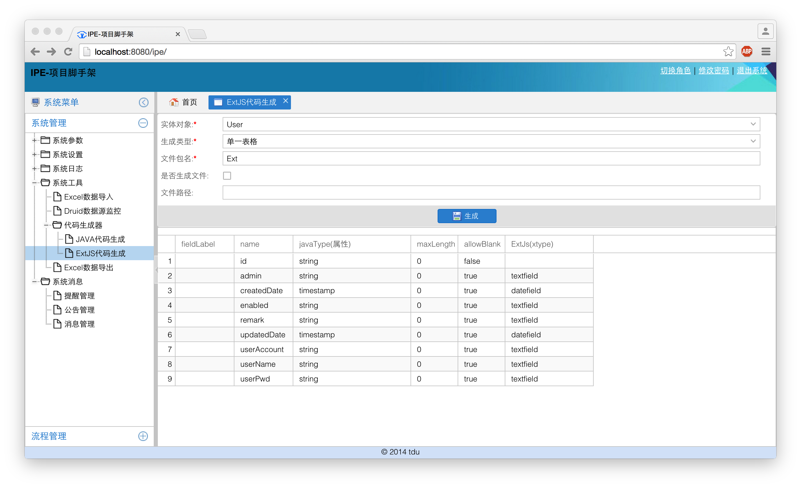
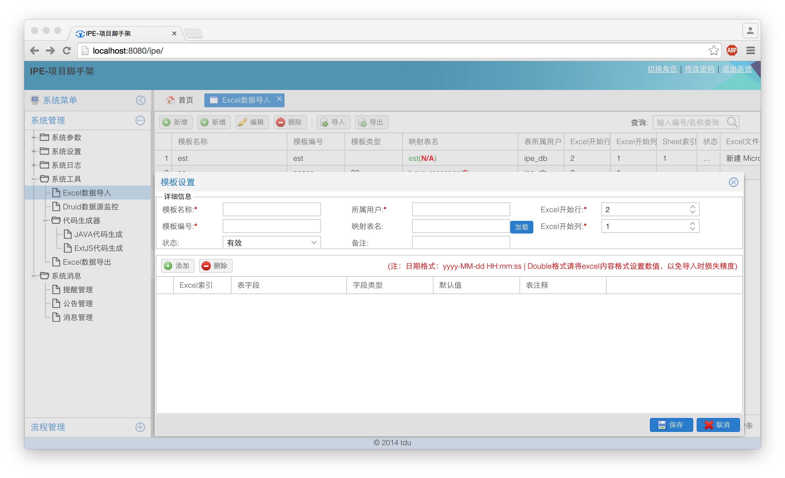
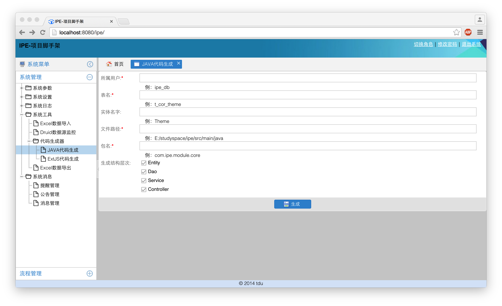
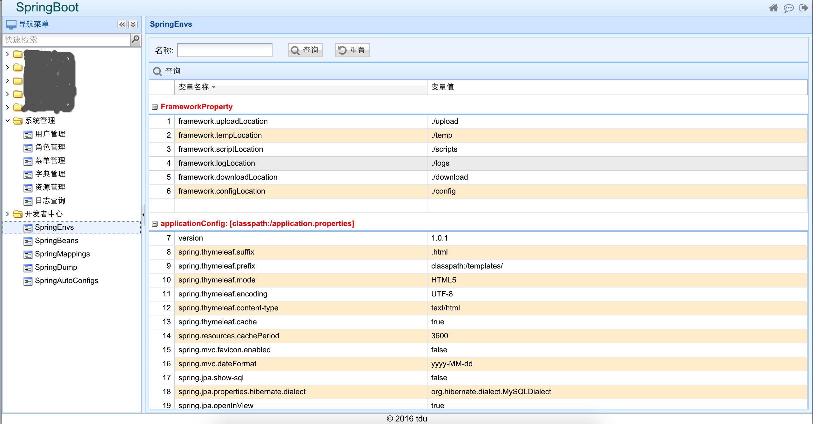

IPE
===

项目脚手架 ExtJS4.2 + Spring3 +Hibernate4.2+Shiro

集成：用户、权限、角色，资源、菜单，消息，公告，字典库、日志、Excel导入，代码生成器、工作流等

Email：tangdu0228@aliyun.com

####系统首页1

####系统首页2

####ExtJS代码生成器

####Excel数据导入导出

####Java代码生成器

#初始化

1 创建用户 执行ipe_db.sql 修改配置文件db.properties

2 构建项目，请确认安装好gradle.请在项目目录下执行 

		# gradle cleanEclipse
		# gradle eclipse

3 将项目部署到tomcat启动
4 默认用户名密码admin/admin

PS:这个项目架构现在已经没有更新了。后面项目全部将用springboot重写以及ExtJS6.

然并卵，新项目也包含模块有基础功能，暂时应该项目原因没有提交。后续会提交

可以先看一个截图，自定义的ExtJS6皮肤，按照我的审美。主题还是浅蓝色，去除了一些圆角。
后期准备对ExtJS写一些能用方法和组件。

现在github上已经有部分springboot 大家可以参考一下。

https://github.com/tangdu/springboot-ssm.git

https://github.com/tangdu/springboot-ssh.git
